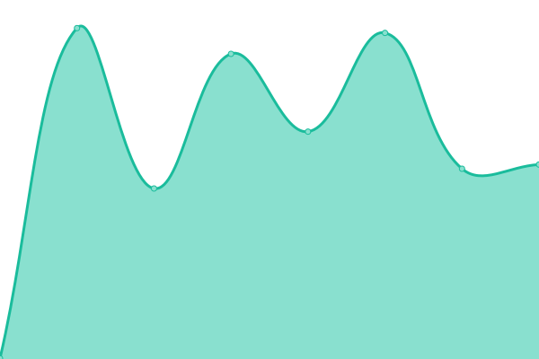

# [📈 Live Status](https://demo.upptime.js.org): <!--live status--> **🟧 Partial outage**

This repository contains the open-source uptime monitor and status page for [Jack Wright](awardls.com), powered by [Upptime](https://github.com/upptime/upptime).

With [Upptime](https://upptime.js.org), you can get your own unlimited and free uptime monitor and status page, powered entirely by a GitHub repository. We use [Issues](https://github.com/jackawardls/jackawardls/upptime/issues) as incident reports, [Actions](https://github.com/jackawardls/jackawardls/upptime/actions) as uptime monitors, and [Pages](https://demo.upptime.js.org) for the status page.

<!--start: status pages-->
<!-- This summary is generated by Upptime (https://github.com/upptime/upptime) -->
<!-- Do not edit this manually, your changes will be overwritten -->
<!-- prettier-ignore -->
| URL | Status | History | Response Time | Uptime |
| --- | ------ | ------- | ------------- | ------ |
|  [Upptimetest down site](http://server1.awardls.com/upptimetest/down) | 🟥 Down | [upptimetest-down-site.yml](https://github.com/jackawardls/upptime/commits/HEAD/history/upptimetest-down-site.yml) | 

 382ms
     
 | 

<a href="https://awardls.com/history/upptimetest-down-site">100.00%</a>
    

|  [Upptimetest up site](http://server1.awardls.com/upptimetest/up) | 🟩 Up | [upptimetest-up-site.yml](https://github.com/jackawardls/upptime/commits/HEAD/history/upptimetest-up-site.yml) | 

 309ms
     
 | 

<a href="https://awardls.com/history/upptimetest-up-site">100.00%</a>
    

|  [DevLearn](https://devlearn.co.uk) | 🟩 Up | [dev-learn.yml](https://github.com/jackawardls/upptime/commits/HEAD/history/dev-learn.yml) | 

 1928ms
     
 | 

<a href="https://awardls.com/history/dev-learn">100.00%</a>
    

|  [DevLearn Moodle](https://devlearn.co.uk/moodle) | 🟩 Up | [dev-learn-moodle.yml](https://github.com/jackawardls/upptime/commits/HEAD/history/dev-learn-moodle.yml) | 

 879ms
     
 | 

<a href="https://awardls.com/history/dev-learn-moodle">100.00%</a>
    

<!--end: status pages-->

[**Visit our status website →**](https://demo.upptime.js.org)

## 📄 License

- Powered by: [Upptime](https://github.com/upptime/upptime)
- Code: [MIT](./LICENSE) © [Jack Wright](awardls.com)
- Data in the `./history` directory: [Open Database License](https://opendatacommons.org/licenses/odbl/1-0/)
